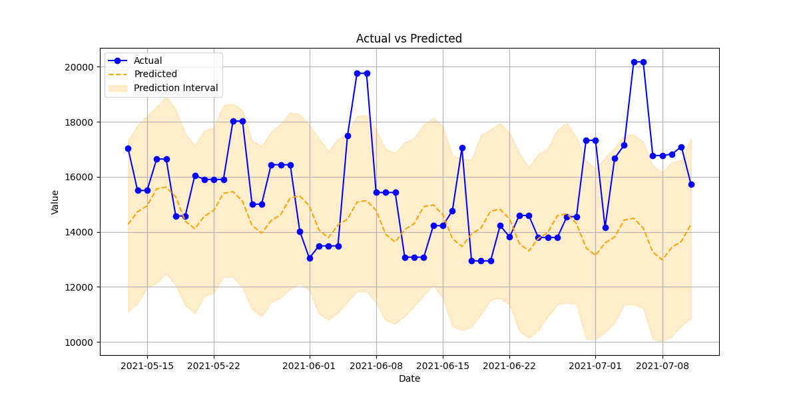
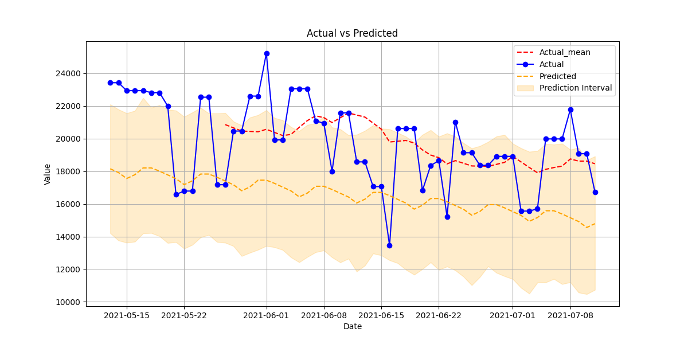
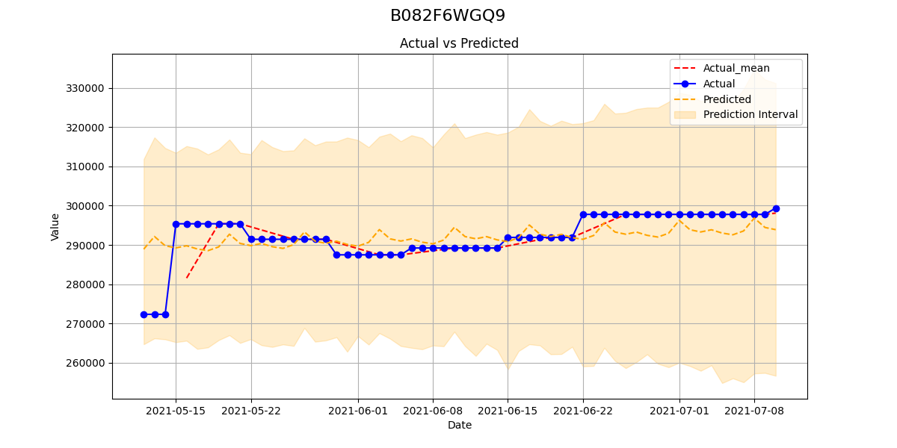

Amazon Sales Data Analysis Project
This project focuses on the analysis of Amazon sales data. It is intended for personal demonstration and learning purposes only. The project must not be used for commercial purposes without prior permission. If you wish to use it commercially, please contact me.
The code was completed around 2021 but was not published online due to certain reasons. The data used in this project is sourced from real Amazon sales data. However, due to legal concerns, the data source is not included in the GitHub repository.
Project Objective
The main goal of this project is to predict sales cycles. If you are interested in uncovering the sales potential of new products or identifying trending items, please refer to another project on my GitHub profile.
This project utilizes the Prophet library to analyze Amazon's cyclical sales data. The process includes training on historical data, evaluation, and prediction. It is recommended for products with strong seasonality, such as beauty and health categories.
How It Works
1.
Data Preparation: The program preprocesses and completes the original data, storing it in a specified local directory. Files are named in the format:
xxxxxxxxxx_500_Pet Supplies.csv
Here:
2.
1.xxxxxxxxxx represents the product code.
2.500 indicates the filtered data length.
3.Pet represents the keyword used to filter product categories (e.g., "Pet" filters all filenames containing this keyword).
3.
Training and Evaluation: If training and evaluation are specified, the results are automatically generated in the following format:
4.
1.Product Code
2.Mean Absolute Percentage Error (MAPE)
3.Data Coverage: Prophet predicts an interval, and a higher coverage indicates higher accuracy.
4.Root Mean Squared Error (RMSE)
Prophet generally works better without normalization. Therefore, the code does not perform normalization. If your data contains extreme value differences, please contact me for normalization code.

Prediction Examples
Below are examples of predictions based on real data. The prediction period is set to 60 days from the completion of the code. Predictions are on a daily basis; if you need weekly or monthly predictions, please modify the code accordingly or contact me for assistance.
1.
Product 1: The predicted sales cycles closely align with the actual data, with most blue points falling within the forecast range.

2.
3.
Product 2: Although the overall prediction for Product 2 is slightly underestimated, it still reveals the trend of declining sales.

4.
5.
Product 3: For products with stable sales, the model provides highly accurate results.

6.

How to Use
1.Download the code.
2.Install the necessary dependencies (refer to requirements.txt). If you encounter any installation issues, please fix them based on the error messages or contact me for the Anaconda environment package.
3.Set the PyCharm root directory to code_model. Failure to do so may cause directory errors that prevent the program from running.
4.Run the main script: model_Prophet_for_amazon.py.

Contact Information
For inquiries, contact me at: 40288327@qq.com

项目名称：亚马逊销售数据分析
以下为英文翻译内容

本项目专注于亚马逊销售数据分析，主要用于个人展示，仅限学习和实验用途。禁止用于商业目的，如需商业用途，请提前联系我。
代码大约在 2021 年完成，由于某些原因未公开发布。本项目使用的数据均来自真实的亚马逊销售数据。由于法律问题，数据源未包含在 GitHub 仓库中。

项目目标
本项目的主要目标是预测销售周期。如果您希望发掘新商品的销售潜力或寻找爆品，请参考我主页的另一个项目。
项目使用 Prophet 库分析亚马逊周期性销售数据，包括对历史数据的训练、评估和预测。建议用于周期性较强的商品，例如美妆、健康等类别。

运行流程
1.
数据准备：程序会整理和补全原始数据，存储到本地指定目录下。文件命名格式为：
xxxxxxxxxx_500_Pet Supplies.csv
其中：
2.
1.xxxxxxxxxx 表示商品代码。
2.500 表示筛选后数据的长度。
3.Pet 表示商品类别关键字（如“Pet”筛选文件名包含该关键字的所有商品）。
3.
训练与评估：指定训练和评估后，程序会自动生成如下结果：
4.
1.商品代码
2.平均绝对百分比误差 (MAPE)
3.数据覆盖率：Prophet 预测区间的覆盖率越高，说明准确性越高。
4.均方根误差 (RMSE)
Prophet 在不归一化的情况下通常效果更优，因此本代码未做归一化。如数据中数值差距极大，请联系我获取归一化代码。

预测效果示例
以下是基于部分真实数据的预测效果图，预测周期为代码完成时的 60 天，以天为单位。如需以月或周为单位，请自行修改代码或与我联系。
1.
商品 1：预测的销售周期与实际周期基本一致，大部分蓝点落在预测区间内。
(images/Figure_1.png)
2.
3.
商品 2：虽然总体预测值偏低，但能揭示商品销售总体下滑的趋势。
(images/Figure_2.png)
4.
5.
商品 3：对于销售趋于平稳的商品，模型效果良好。
(images/Figure_4.png)
6.

使用方法
1.下载代码。
2.安装必要依赖（见 requirements.txt）。如遇安装问题，请根据错误提示解决或联系我获取 Anaconda 环境包。
3.将 PyCharm 的根目录设置为 code_model，否则部分目录可能出错导致程序无法运行。
4.运行主程序：model_Prophet_for_amazon.py。

联系方式
如需帮助，请联系我：40288327@qq.com
